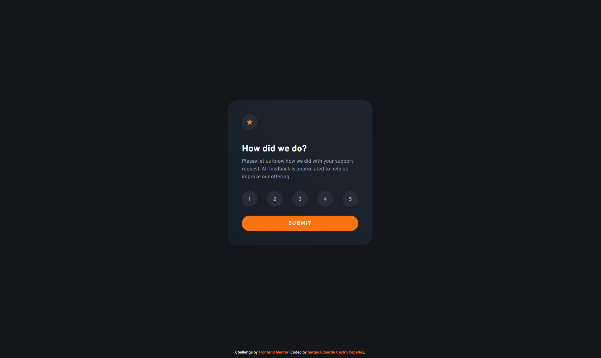

# Frontend Mentor - Interactive rating component solution

This is a solution to the [Interactive rating component challenge on Frontend Mentor](https://www.frontendmentor.io/challenges/interactive-rating-component-koxpeBUmI). Frontend Mentor challenges help you improve your coding skills by building realistic projects.

## Table of contents

- [Overview](#overview)
  - [The challenge](#the-challenge)
  - [Screenshot](#screenshot)
  - [Links](#links)
- [My process](#my-process)
  - [Built with](#built-with)
  - [What I learned](#what-i-learned)
  - [Improvements](#future-improvements)
  - [Useful resources](#useful-resources)
- [Author](#author)

**Note: Delete this note and update the table of contents based on what sections you keep.**

## Overview

### The challenge

Users should be able to:

- View the optimal layout for the app depending on their device's screen size
- See hover states for all interactive elements on the page
- Select and submit a number rating
- See the "Thank you" card state after submitting a rating

### Screenshot

### Links

- Solution URL: [Frontend Mentor Solution](https://www.frontendmentor.io/solutions/responsive-interactive-rating-component-hiIHspc-T1)
- Live Site URL: [netlify live site](https://fm-interactive-rating-component-sc.netlify.app)

## My process

### Built with

- Semantic HTML5 markup
- CSS custom properties
- Flexbox
- CSS Grid
- Mobile-first workflow
- [Fluid Typography](https://royalfig.github.io/fluid-typography-calculator/)
- [Angular](https://angular.dev/overview)

### What I learned

This project was a great way to support my Angular learning. Its simplicity made it easy to design and develop, giving me the chance to practice core Angular concepts like inputs, outputs, and conditional rendering.

### Future Improvements

For future update, some type of form validation will definitively be useful, as this will provide feedback to the user about the state of the rating form, such as missing inputs or possible errors.

### Useful resources

- [Fluid Typography](https://royalfig.github.io/fluid-typography-calculator/)
- [Google Fonts](https://fonts.google.com)
- [Angular Docs](https://angular.dev/overview)

## Author

- Website - [Sergio Eduardo Castro Ceballos](https://sergiocas.com)
- Frontend Mentor - [@SergioCasCeb](https://www.frontendmentor.io/profile/SergioCasCeb)
- Github - [@SergioCasCeb](https://github.com/SergioCasCeb)
